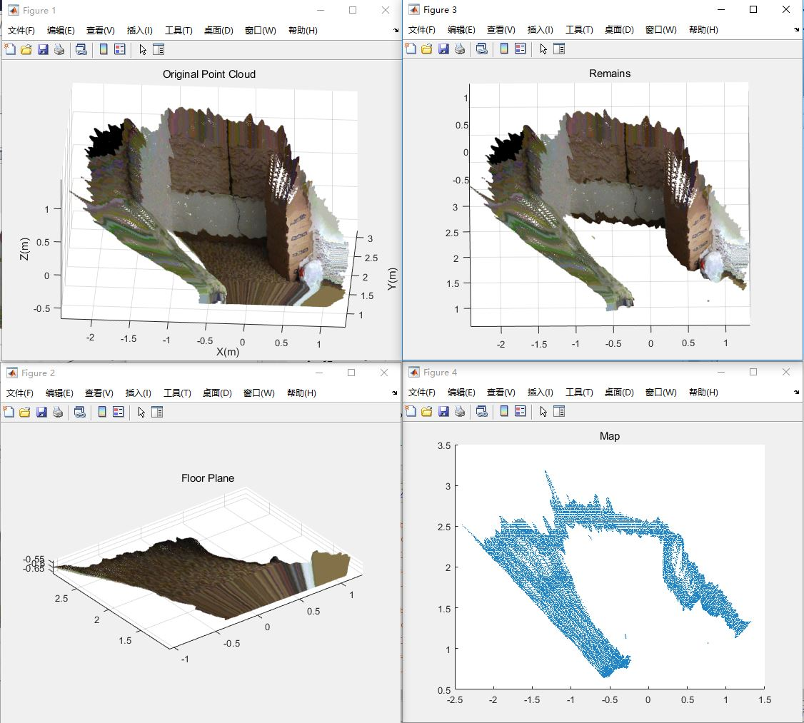
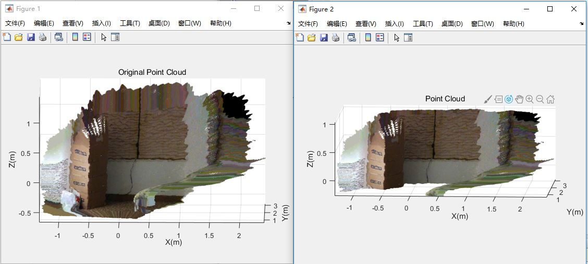

## Point Cloud Utils for Robotics Guide Dog

* This folder contains utility code for processing point cloud data used by our system. by using point cloud, we can get a more accurate map from depth camera. 

### Subfolders:

    1. experiments: MATLAB code for experiments on point cloud(Conputer Vision Systame Toolbox)
    2. sample: sample point cloud data in .ply format
   
### Experiments:

#### Generate point cloud from .bag file

use the **save_pointcloud_to_ply** function in **rs_depth_util.py** under **realsense** folder

#### Use MATLAB to process and show the point cloud

Remember first to put code and sample to a directory that is visible to MATLAB.

1. use RANSAC to fit the ground plane with a pre-defined normal vector:
   
    pipline_fit()

2. crop the point cloud with a ROI(region of interest):

    pipline_crop()

#### Use Python to perform simple point cloud processing

1. Use Open3D to denoise and  display point cloud